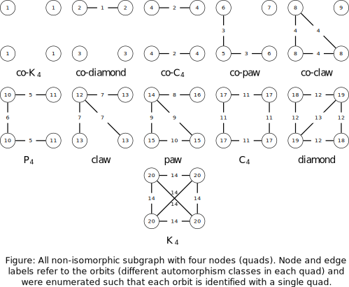

<!-- README.md is generated from README.Rmd. Please edit that file -->

# oaqc

<!-- badges: start -->
<!-- badges: end -->

This package provides an efficient algorithm to calculate for a given
graph the **o**rbit-**a**ware **q**uad **c**ensus. More precisely the
frequency distribution of all induced and non-induced non-isomorphic
four node subgraphs, i.e. <i>quads</i>, on a node and edge level; see
the figure below for the relation between orbit and quad.

<figure>

<figcaption aria-hidden="true">quad census</figcaption>
</figure>

## Installation

You can install the development version of oaqc like so:

``` r
remotes::install_github("schochastics/oaqc")
```

## Input

The input can either be an edgelist (matrix or data.frame) or a graph
Object (‘igraph’)

Despite the input format the graph should not contain loops or
multi-edges and the vertex indices have to lie in range \[0,n-1) with n
denoting the number of vertices in the graph. Note that if the smallest
index is 1 the algorithm will create an isolated vertex with index 0.

## Calculating the orbit-aware quad census

The following code exemplifies the use of this package.

``` r
library(oaqc)
### k4, pure R
k4 <- data.frame(
    source = c(0, 0, 0, 1, 1, 2),
    target = c(1, 2, 3, 2, 3, 3)
)
k4orbits <- oaqc(k4, non_ind_freq = FALSE, file = "")
k4orbits
#> $n_orbits_ind
#>      [,1] [,2] [,3] [,4] [,5] [,6] [,7] [,8] [,9] [,10] [,11] [,12] [,13] [,14]
#> [1,]    0    0    0    0    0    0    0    0    0     0     0     0     0     0
#> [2,]    0    0    0    0    0    0    0    0    0     0     0     0     0     0
#> [3,]    0    0    0    0    0    0    0    0    0     0     0     0     0     0
#> [4,]    0    0    0    0    0    0    0    0    0     0     0     0     0     0
#>      [,15] [,16] [,17] [,18] [,19] [,20]
#> [1,]     0     0     0     0     0     1
#> [2,]     0     0     0     0     0     1
#> [3,]     0     0     0     0     0     1
#> [4,]     0     0     0     0     0     1
#> 
#> $e_orbits_ind
#>      [,1] [,2] [,3] [,4] [,5] [,6] [,7] [,8] [,9] [,10] [,11] [,12] [,13] [,14]
#> [1,]    0    0    0    0    0    0    0    0    0     0     0     0     0     1
#> [2,]    0    0    0    0    0    0    0    0    0     0     0     0     0     1
#> [3,]    0    0    0    0    0    0    0    0    0     0     0     0     0     1
#> [4,]    0    0    0    0    0    0    0    0    0     0     0     0     0     1
#> [5,]    0    0    0    0    0    0    0    0    0     0     0     0     0     1
#> [6,]    0    0    0    0    0    0    0    0    0     0     0     0     0     1
```

In order to calculate the non-induced frequencies as well just set the
corresponding flag to `TRUE`.

Since the orbit-aware frequencies can be rather large integers, which
can cause some problems with R, the results can be directly written to a
file.

## Result

The results of the, e.g., induced frequencies of the nodes in orbit 10
can be accessed in the following way.

``` r
k4orbits$n_orbits_ind[, 10]
#> [1] 0 0 0 0
```
